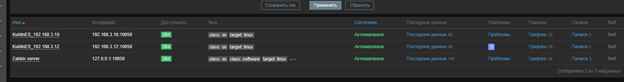

# Домашнее задание к занятию "`Zabbix 2 часть`" - `Куклин Е.С.`

# Задание 1
Создайте свой шаблон, в котором будут элементы данных, мониторящие загрузку CPU и RAM хоста.

# Задание 2
Добавьте в Zabbix два хоста и задайте им имена <фамилия и инициалы-1> и <фамилия и инициалы-2>.

 

# Задание 3
Привяжите созданный шаблон к двум хостам. Также привяжите к обоим хостам шаблон Linux by Zabbix Agent.

 
 
 
# Задание 4
Создайте свой кастомный дашборд.
 
